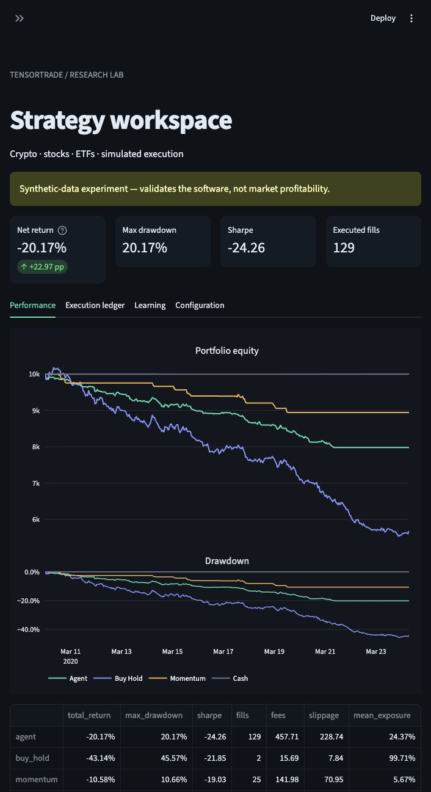
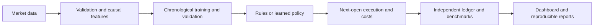

# TensorTrade Lab

[](https://github.com/jnaggud/tensortrade-lab/actions/workflows/test.yml)

[](LICENSE)

**A reproducible platform for trading research, strategy simulation, and reinforcement learning.**

TensorTrade Lab combines a Python CLI, a Streamlit dashboard, and auditable execution ledgers to investigate strategies across cryptocurrencies, US stocks, and ETFs. It supports rule-based strategies, supervised models, PPO policies, and portfolio allocation experiments—with explicit costs and chronological evaluation.



*The quick-start example uses synthetic prices to demonstrate the software. Its returns are not evidence of market profitability.*

## Capabilities

| Area | Implementation |
| --- | --- |
| Market data | Validated CSV/Parquet imports, Yahoo downloads, exchange calendars, and complete-bar aggregation |
| Research | Grid and Optuna TPE searches, expanding-window validation, frozen selections, and cost/delay stress tests |
| Learning | Stable-Baselines3 PPO on TensorTrade environments, supervised ranking, and experimental ensembles |
| Accounting | Next-open execution, fees, adverse slippage, position limits, signed positions, and dividend/cash-interest accounting where configured |
| Compute | Parallel CPU workers with thread budgets; optional CUDA/Apple Metal support and hardware benchmarks |
| Reporting | Interactive equity/drawdown charts, benchmark comparisons, fills, standalone HTML reports, and hashed run manifests |
| Extensions | Experimental futures/options ledgers, dated fundamentals/macro adapters, and ten Pine research examples |

## Quick start

Requires **Python 3.12** and [uv](https://docs.astral.sh/uv/). Run from the repository root:

```bash
git clone https://github.com/jnaggud/tensortrade-lab.git
cd tensortrade-lab
uv sync --frozen --extra dev --extra research --extra cpu --no-editable
uv run --frozen --no-editable --extra cpu ttlab demo
uv run --frozen --no-editable --extra cpu ttlab dashboard
```

Open **http://127.0.0.1:8501** and select **PPO training runs** in the sidebar. The demo generates its own data, trains a small policy, and produces an offline HTML report. No account, API key, or private dataset is needed. The initial installation downloads the pinned dependencies and TensorTrade source.

For an application-only installation, omit `--extra dev --extra research`. Research extensions and the complete test suite require the research extra. The `cpu` extra selects CPU-only PyTorch on Linux/Windows; macOS keeps its standard PyTorch build with optional Metal support. See [GPU setup](docs/GETTING_STARTED.md#gpu-setup) for a separate CUDA environment.

## How an experiment works



Feature scaling fits on training data only. Checkpoints are selected on validation results. Evaluation compares strategies over matched dates and cost assumptions. Run artifacts capture configuration, source hashes, seeds, model versions, and time boundaries.

Different workflows have different accounting assumptions: the original spot model has zero cash interest, while the ETF portfolio study models a lagged Treasury-yield proxy. See the relevant guide before comparing results.

## Choose a workflow

| Workflow | Guide |
| --- | --- |
| Import candles, train PPO, backtest, or replay a paper account | [Getting started](docs/GETTING_STARTED.md) |
| Search assets, timeframes, long/short rules, and hyperparameters | [Multi-market research](docs/RESEARCH_GUIDE.md) |
| Study cross-ETF features and staged PPO training | [Focused ETF study](docs/FOCUSED_ETF_GUIDE.md) |
| Compare ETF rotation, ranking, dividends, and cash interest | [Portfolio allocation](docs/PORTFOLIO_GUIDE.md) |
| Explore ensembles, derivative accounting, and paper-inspired recipes | [Research extensions](research/paper151/README.md) |
| Understand the design and execution sequence | [Architecture](docs/ARCHITECTURE.md) |

## Research findings

This project demonstrates a research process, including unsuccessful hypotheses. The focused PPO and ETF rotation studies did not establish their required buy-and-hold advantage. Later screens found some asset-specific historical improvements, but no newly qualified broadly robust strategy under their declared checks. These outcomes are documented separately from software validation.

[Read the research overview](docs/RESEARCH_RESULTS.md), including study scope, benchmarks, and limitations. The repository contains source and selected summaries; licensed price archives, local account state, and trained checkpoints are excluded. Re-running historical studies requires the corresponding input data. The synthetic demo and default tests are self-contained.

## Development

```bash
uv sync --frozen --extra dev --extra research --extra cpu --no-editable
uv run --frozen --no-editable --extra cpu pytest -q
uv run --frozen --no-editable --extra cpu ruff check src tests scripts
uv run --frozen --no-editable --extra cpu ruff format --check src tests scripts
python scripts/check_release.py
```

GitHub Actions checks the public test suite and a synthetic training smoke test on Linux. Four additional reconciliation cases use separately supplied TradingView exports and are explicitly opt-in. See [contributing](CONTRIBUTING.md) for setup, testing, and research-data requirements.

## Scope

The system performs historical simulation and paper replay. It has no configured live broker route. Fees, slippage, borrow, and cash yields are modeled assumptions; bar data cannot establish real order-book fills or intrabar stop paths. Historical returns and synthetic demonstrations do not establish future profitability.

## License and acknowledgments

Original project code is available under [Apache 2.0](LICENSE). Built on [TensorTrade](https://github.com/tensortrade-org/tensortrade), with Stable-Baselines3, PyTorch, Optuna, pandas, and Streamlit. This is an independent project, not an official TensorTrade release. See [third-party notices](NOTICE) and [upstream integration notes](docs/UPSTREAM_REVIEW.md).

[Portfolio case study](docs/PORTFOLIO_CASE_STUDY.md) · [Release notes](CHANGELOG.md)
