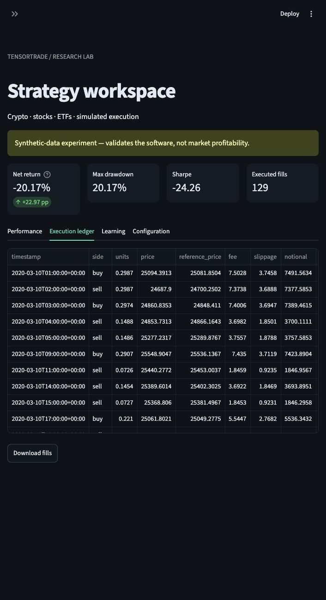

# TensorTrade Lab portfolio case study

**Project title:** Multi Asset Trading Research and Backtesting Platform

**Role:** Python development, research-system architecture, execution modeling, and dashboard delivery.

**Project description:**

Built a Python research platform for crypto, stocks, and ETFs with TensorTrade, PPO, and a Streamlit dashboard. Implemented parallel strategy searches, chronological validation, transaction-cost modeling, portfolio accounting, and reproducible reports. Added synthetic tests for execution timing and ledger reconciliation, plus experimental futures/options and ensemble modules. Delivered a documented CLI and automated CI; research results distinguish historical simulations from live performance.

**Skills:** Python · Machine Learning · Data Analysis · Backtesting · Streamlit

**Repository:** https://github.com/jnaggud/tensortrade-lab

## Engineering highlights

- A shared research workflow connects validated market data, causal features, simulation, benchmarks, and reports.
- Resource-budgeted parallel workers run independent experiments while controlling numerical-library threads.
- Chronological validation and training-only normalization address common sources of look-ahead leakage.
- Independent accounting checks compare cash, positions, corporate actions, fees, and marked equity.
- Experiments retain configurations, source checksums, model versions, seeds, and evaluation boundaries.
- A self-contained synthetic demonstration lets reviewers evaluate the software without access to private market archives.

## Screenshots

The screenshot demonstrates the application's research workflow using generated prices. It should be presented as a software example, not a profitable live trading account.

## Results and scope

The deliverable is a working research application, source code, automated validation, and documented studies. Some tested strategies reduced drawdown or outperformed individual historical benchmarks; the published studies did not establish a broadly robust future trading advantage. There is no configured real-money broker integration.

The [research overview](RESEARCH_RESULTS.md) records what was tested and the limitations. The [README](../README.md) provides installation and a short demonstration.
